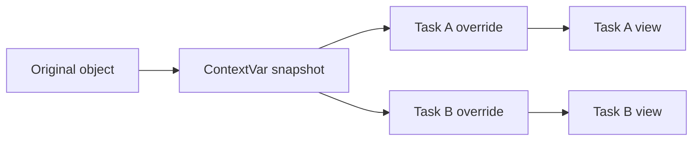

# Context Cages

`Cage` gives you context-local mutable views over shared state.

## Context Behavior

## Why It Matters

- Isolates mutable behavior across async tasks and nested contexts.
- Supports update merge functions for controlled state synchronization.
- Supports optional lock wrapper for thread-safe original updates.

## Related

- [Reference: cages](../reference/cages.md)
- [Guide: testing with overrides](../guides/testing-with-overrides.md)
