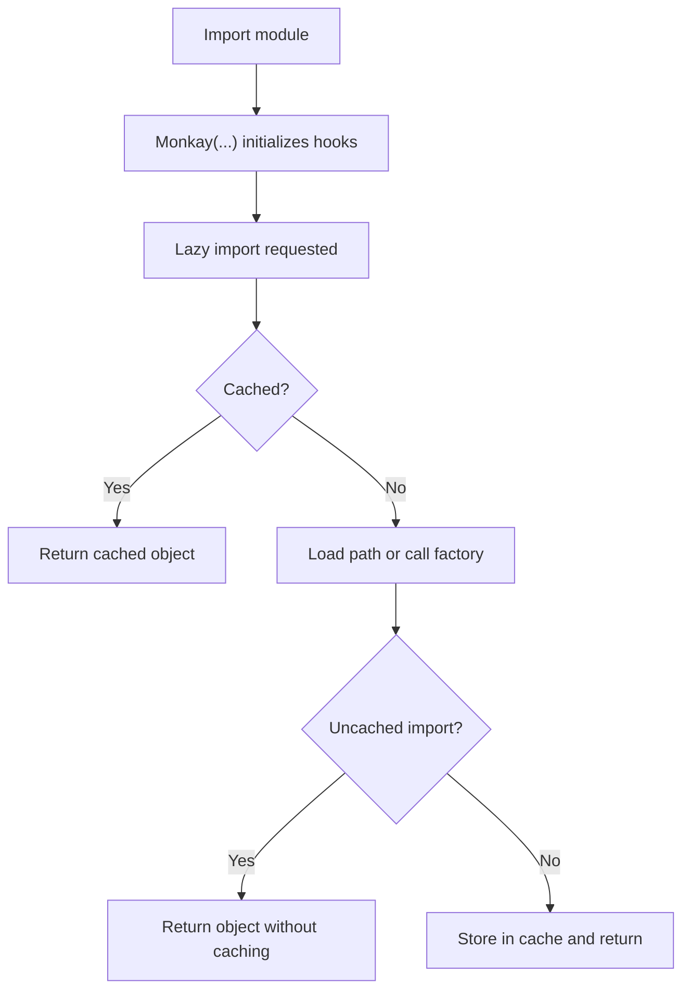

# Module Lifecycle

Monkay sits between module import-time and runtime access.

## Flow

## Key Implications

- Lazy imports are resolved by module-level `__getattr__`.
- Optional uncached imports keep values dynamic per access.
- Deprecated lazy imports issue warnings while preserving compatibility.

## Related

- [Reference: tutorial](../reference/tutorial.md)
- [Guide: lazy imports and deprecations](../guides/lazy-imports-and-deprecations.md)
