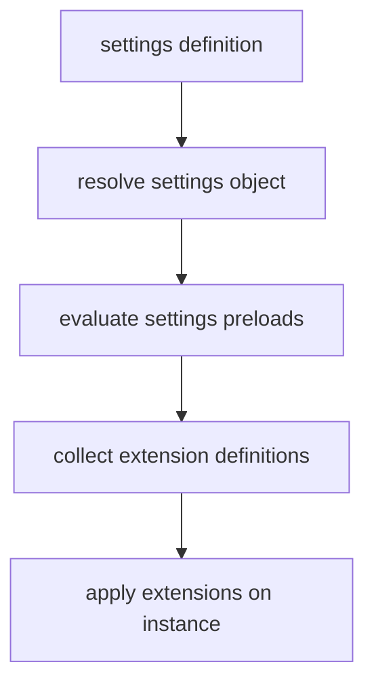

# Settings and Extensions

Settings and extension application are separate but coordinated phases.

## Evaluation Flow

## Design Notes

- Settings can be a path, class, callable, or object.
- Temporary overrides (`with_settings`, `with_full_overwrite`) are context-local.
- Extension ordering can be customized with `extension_order_key_fn`.

## Safety Notes

- Use `on_conflict` policies intentionally (`error`, `keep`, `replace`).
- Keep extension side effects idempotent where possible.

## Related

- [Reference: settings](../reference/settings.md)
- [Guide: testing with overrides](../guides/testing-with-overrides.md)
