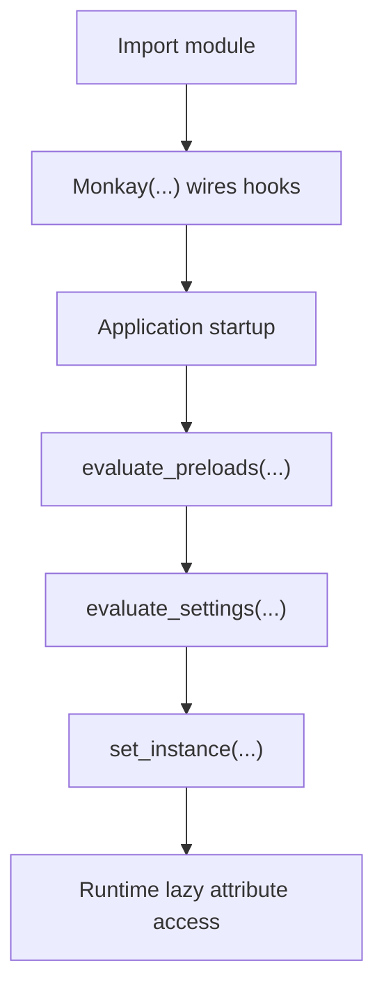

# Monkay

Monkay provides a safe lifecycle layer for Python modules that need lazy imports,
settings evaluation, extension orchestration, and context-local mutable state.

## At a Glance

- **Lazy imports** with configurable caching and deprecation warnings
- **Settings orchestration** with runtime evaluation and temporary overrides
- **Extension pipeline** with explicit conflict modes (`error`, `keep`, `replace`)
- **Context cages** for per-task/per-thread state isolation
- **ASGI helpers** for deterministic startup/shutdown integration

## Typical Lifecycle



## Minimal Quickstart

```python
from monkay import Monkay

monkay = Monkay(
    globals(),
    lazy_imports={"json_dumps": "json:dumps"},
)
```

Continue in [Install and first module](getting-started/install-and-first-module.md).

## Learning Paths

### New to Monkay

1. [Getting Started](getting-started/index.md)
2. [Tutorials](tutorials/index.md)
3. [Core Concepts](concepts/index.md)

### Integrating into an Existing Codebase

1. [Configuration reference](reference/configuration.md)
2. [Lazy imports and deprecations](guides/lazy-imports-and-deprecations.md)
3. [Testing with overrides](guides/testing-with-overrides.md)
4. [Error handling](guides/error-handling.md)

### Running in Production

1. [First production run](getting-started/first-production-run.md)
2. [Performance and best practices](guides/performance-best-practices.md)
3. [FAQ and troubleshooting](project/faq-troubleshooting.md)

## Quick Links

- [Installation and compatibility](getting-started/installation-and-compatibility.md)
- [Build your first module tutorial](tutorials/build-first-module.md)
- [API reference](reference/api.md)
- [Contributing](project/contributing.md)
